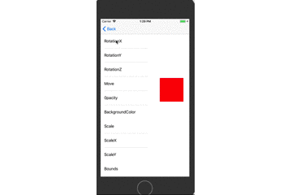

### BasicAnimation

1、keyPath

       rotation 旋轉
    
       scale 缩放
     
       translation 平移
       
       CGPoint Key Paths : (example)position.x 位移
    
       CGRect Key Paths : (example)bounds.size.width 伸缩
    
       origin 原点
       
       size 大小
       
       opacity 透明度
       
       backgroundColor  背景 颜色
     
       contents  内容
       
       Shadow Key Path: 阴影
       
2、

     duration：动画的持续时间
     
     
3、
　　<pre>repeatCount：动画的重复次数</pre>

4、
　　<pre>timingFunction：动画的时间节奏控制</pre>
       
  
5、Use
     

        case 0:
            animation = [CABasicAnimation animationWithKeyPath:@"transform.rotation.x"];
            //setFromValue不设置,默认以当前状态为准
            [animation setToValue:@(2 * M_PI)];
            break;
        case 1:
            animation = [CABasicAnimation animationWithKeyPath:@"transform.rotation.y"];
            //setFromValue不设置,默认以当前状态为准
            [animation setToValue:@(2 * M_PI)];
            break;
        case 2:
            animation = [CABasicAnimation animationWithKeyPath:@"transform.rotation.z"];
            //setFromValue不设置,默认以当前状态为准
            [animation setToValue:@(2 * M_PI)];
            break;
        case 3:
            //平移
            animation = [CABasicAnimation animationWithKeyPath:@"position"];
            //setFromValue不设置,默认以当前状态为准
            [animation setToValue:[NSValue valueWithCGPoint:CGPointMake(self.redView.center.x, self.redView.center.y + 200)]];
            break;
        case 4:
            animation = [CABasicAnimation animationWithKeyPath:@"opacity"];
            [animation setFromValue:@1.0];
            [animation setToValue:@0.1];
            break;
        case 5:
            animation = [CABasicAnimation animationWithKeyPath:@"backgroundColor"];
            animation.fromValue = (__bridge id _Nullable)([UIColor redColor].CGColor);
            animation.toValue = (__bridge id _Nullable)([UIColor greenColor].CGColor);
           
            break;
        case 6:
            animation = [CABasicAnimation animationWithKeyPath:@"transform.scale"];
            [animation setFromValue:@1.0];
            [animation setToValue:@0.1];
            break;
        case 7:
            animation = [CABasicAnimation animationWithKeyPath:@"transform.scale.x"];
            [animation setFromValue:@1.0];
            [animation setToValue:@0.1];
            break;
        case 8:
            animation = [CABasicAnimation animationWithKeyPath:@"transform.scale.y"];
            [animation setFromValue:@1.0];
            [animation setToValue:@0.1];
            break;
        case 9:
            animation = [CABasicAnimation animationWithKeyPath:@"bounds"];
            [animation setToValue:[NSValue valueWithCGRect:CGRectMake(self.redView.frame.origin.x, self.redView.frame.origin.y, 200, 200)]];
            break;
            
        default:
            break;
    }
    [animation setDelegate:self];//代理回调
    [animation setDuration:1];//设置动画时间，单次动画时间
    [animation setRemovedOnCompletion:NO];//默认为YES,设置为NO时setFillMode有效
    [animation setTimingFunction:[CAMediaTimingFunction functionWithName:kCAMediaTimingFunctionEaseInEaseOut]];
    [animation setAutoreverses:YES];
    [animation setFillMode:kCAFillModeBoth];
    [self.redView.layer addAnimation:animation forKey:@"basicAnimation"];

